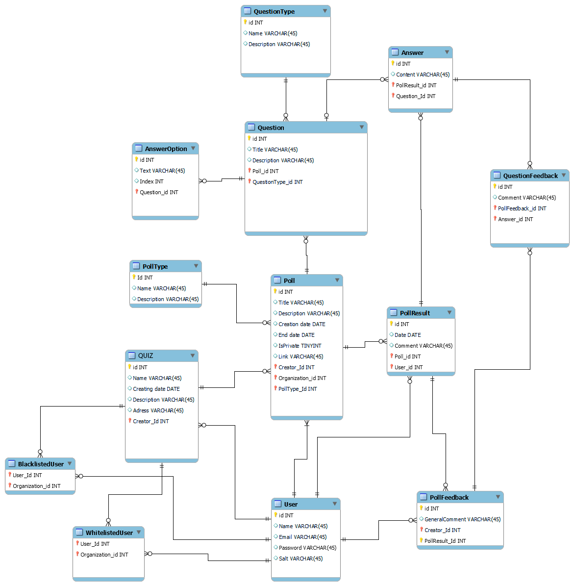

# Проєктування бази даних

В рамках проекту розробляється:

## Модель бізнес-об'єктів

@startuml
  entity User #eeff34
  entity User.Name 
  entity Email
  entity Password
  entity Salt
  entity Authorization_Token

  entity QUIZ #eeffff
  entity QUIZ.Name
  entity QUIZ.Creation_date
  entity Creator #FF00FF
  entity QUIZ.Description #FF00FF
  entity Picture #FF00FF 
  entity Address #FF00FF
  entity Poll

  entity PollType.Name
  entity PollType.Description #FF00FF

  entity BlackListedUser #eeffff
  entity BL_User
  entity BL_Poll 

  entity WhiteListedUser #eeffff
  entity WL_User
  entity WL_Poll 

  entity Poll #eeffff
  entity Poll.Title
  entity Poll.Description
  Entity Poll.CreationDate
  entity End_Date
  entity IsWhiteList
  entity IsBlackList
  entity IsPrivate
  entity Link
  entity Poll.Type #eeffff

  entity QuestionType #eeffff
  entity QuestionType.Name
  entity QuestionType.Description

  entity AnswerOption #eeffff
  entity Text
  entity Index

  entity Question #eeffff
  entity Question.Title
  entity Question.Description
  entity Question.Type

  entity Answer #eeffff
  entity Content

  entity PollResult #eeffff
  entity Date
  entity Respondent

  entity QuestionFeedback #eeffff
  entity QF_Comment
  entity QF_Question

  entity PollFeedback #eeffff
  entity GeneralComment
  entity Rating #FF00FF
  entity MaxRating #FF00FF
  entity Reviewer
  entity PF_Poll

  User.Name --* User
  Email -r-* User
  Password --* User
  Salt -l-* User
  Authorization_Token -u-* User
  Poll "0,*"--*"1,1" User
  QUIZ "0,*"--*"0,*" User
  PollFeedback "0,*"--*"1" User

  QUIZ.Name -l-* QUIZ
  QUIZ.Creation_date -u-* QUIZ
  Creator *-d-* QUIZ
  QUIZ.Description --* QUIZ
  Picture -d-* QUIZ
  Address -r-* QUIZ
  Poll "0,*"--*"1" QUIZ

  PollType.Name -u-* Poll.Type
  PollType.Description --* Poll.Type

  BlackListedUser -u-* BL_User
  BlackListedUser --* BL_Poll
  BlackListedUser "1"--"0,*" User
  BlackListedUser "1"--"0,*" QUIZ
  WhiteListedUser -u-* WL_User
  WhiteListedUser --* WL_Poll
  WhiteListedUser "1"--"0,*" User
  WhiteListedUser "1"--"0,*" QUIZ

  Poll.Title -u-* Poll
  Poll.Description -u-* Poll
  Poll.CreationDate --* Poll
  End_Date --* Poll
  IsWhiteList --* Poll
  IsBlackList -l-* Poll
  IsPrivate -r-* Poll
  Link -u-* Poll
  Poll.Type "0,*"-d-*"1" Poll
  Question "1"--*"0,*" Poll

  QuestionType.Name -u-* QuestionType 
  QuestionType.Description -d-* QuestionType
  QuestionType "0,*"--"1" Question
  QuestionType "0,*"--"1,1" Answer

  Text --* AnswerOption
  Index --* AnswerOption

  AnswerOption "0,*"--*"1" Question
  Question --* Question.Type
  Question.Title --* Question
  Question.Description -l-* Question
  AnswerFeedback "0,*"--*"1,1" Question

  Answer --* Content
  Answer "0,*"--*"1,1" Question

  Date --* PollResult
  Comment --* PollResult
  Respondent --* PollResult
  Answer "0,*"--*"1" PollResult

  QF_Comment --* QuestionFeedback
  QuestionFeedback *--* QF_Question

  GeneralComment -l-* PollFeedback
  Rating --* PollFeedback
  MaxRating --* PollFeedback
  Reviewer -u-* PollFeedback
  PF_Poll -u-* PollFeedback
  QuestionFeedback "0,*"-u-*"1,1" PollFeedback

@enduml
  

    

## ER-модель

@startuml

  entity User <<ENTITY>> #FF9999{
      Name: TEXT
      Email: TEXT
      Password: TEXT
      Salt: TEXT
      Authorization_Token: TEXT
  }

  entity QUIZ <<ENTITY>> #FF9999{
      Name: TEXT
      Creation_date: DATE
      Creator: TEXT
      Description: TEXT
      Picture: IMAGE
      Address: TEXT
  }

  entity PollType <<ENTITY>> #FF9999{
      Name: TEXT
      Description: TEXT
  }

  entity BlackListedUser <<ENTITY>> #FF9999{
      BL_User: TEXT
      BL_Poll: TEXT
  }

  entity WhiteListedUser <<ENTITY>> #FF9999{
      WL_User: TEXT
      WL_Poll: TEXT
  }

  entity Poll <<ENTITY>> #FF9999{
      Title: TEXT
      Description: TEXT
      CreationDate: DATE
      End_Date: TEXT
      IsWhiteList: BOOL
      IsBlackList: BOOL
      IsPrivate: BOOL
      Link: TEXT
      Type: TEXT
  }

  entity QuestionType <<ENTITY>> #FF9999{
      Name: TEXT
      Description: TEXT
  }

  entity AnswerOption <<ENTITY>> #FF9999{
      Name: TEXT
      Index: NUMBER
  }
  entity Question <<ENTITY>> #FF9999{
      Title: TEXT
      Description: TEXT
      Type: TEXT
  }

  entity Answer <<ENTITY>> #FF9999{
      Content: TEXT
      Question: TEXT
      QuestionType: TEXT
  }

  entity PollResult <<ENTITY>> #FF9999{
      Date: DATE
      PR_Comment: TEXT
      Respondent: TEXT
  }

  entity QuestionFeedback <<ENTITY>> #FF9999{
      QF_Comment: TEXT
      QF_Qeustion: TEXT
  }

  entity PollFeedback <<ENTITY>> #FF9999{
      GeneralComment: TEXT
      Rating: NUMBER
      MaxRating: NUMBER
      Reviewer: TEXT
      PF_Poll: TEXT
  }

  Poll "0,*"--*"1,1" User
  QUIZ "0,*"--*"1,1" User
  PollFeedback "0,*"--*"1,1" User

  Poll "0,*"--*"1,1" QUIZ

  BlackListedUser "1,1"*--"0,*" User
  BlackListedUser "1,1"--*"0,*" QUIZ

  WhiteListedUser "1,1"*--"0,*" User
  WhiteListedUser "1,1"--*"0,*" QUIZ

  Question "0,*"--*"1,1" Poll

  Answer "0,*"--*"1,1" Question
  Answer "0,*"--*"1,1" PollResult

  AnswerOption "0,*"--*"1,1" Question
  PollType "0,*"-d-*"1,1" Poll
  QuestionType "0,*"--*"1,1" Question
  QuestionType "0,*"--*"1,1" Answer

  QuestionFeedback "0,*"--*"1,1" PollFeedback

@enduml
  

    

## Реляційна схема

